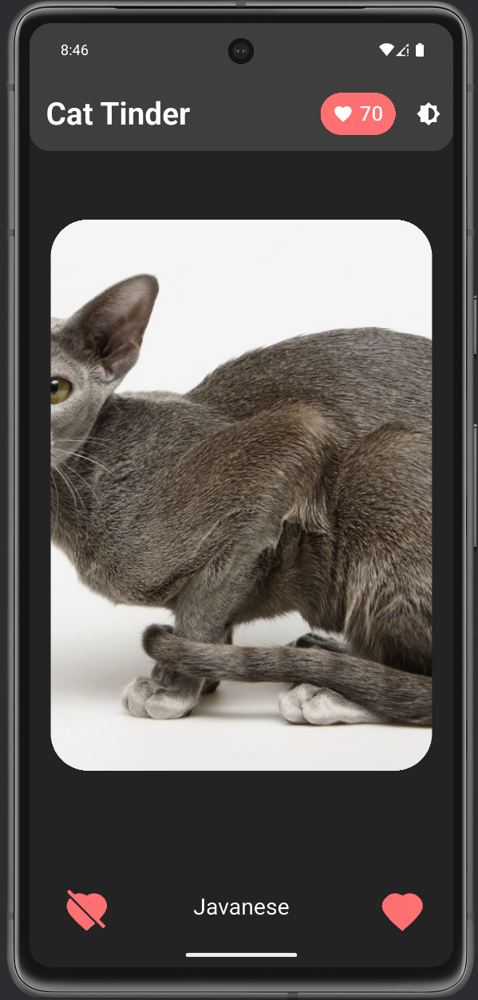
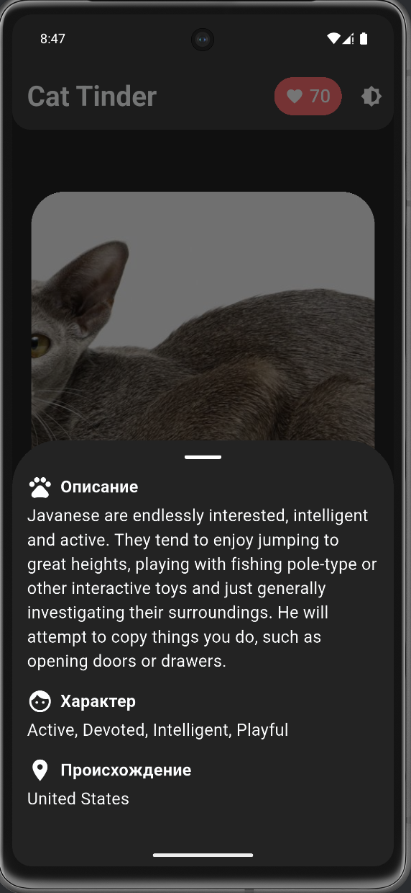
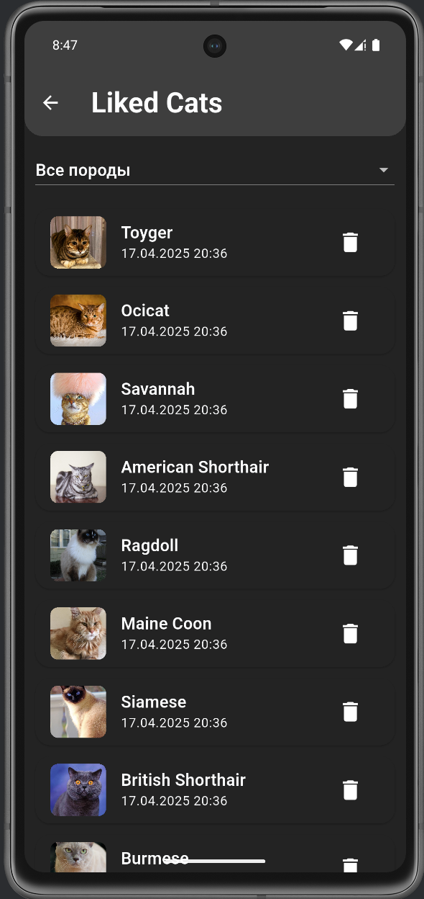

# Cat Tinder 😻

Приложение‑тренажёр для свайпов: знакомьтесь с пушистыми, лайкайте, ведите список избранных.  
Работает на Flutter 3.7+, поддерживает светлую и тёмную темы.

## Скриншоты
| Главный экран | Детали породы | Лайкнутые |
|:--:|:--:|:--:|
|  |  |  |

## Функциональность
- **Свайпы** ←/→ или кнопки 👍 / 👎  
- **Список лайкнутых** с фильтром по породе и удалением свайпом ↔ / иконкой 🗑  
- **Счётчик лайков** в AppBar (динамически, совпадает с количеством в избранном)  
- **Детальная карточка** с описанием, характером, происхождением  
- **Автоподгрузка** карточек, CircularProgressIndicator и заглушка‑картинка при ожидании  
- **Переключение темы** 🌚 / 🌝  
- **Обработка ошибок сети** (AlertDialog + кнопка «Повторить»)

## Технологии
| Категория | Используется |
|-----------|--------------|
| UI | **Flutter 3.7+, Material 3** |
| State‑management | **Provider + ChangeNotifier** |
| DI | **get_it** |
| HTTP | **http** |
| Кэш изображений | **cached_network_image** |
| Конфиги | **flutter_dotenv** |
| API | [TheCatAPI](https://thecatapi.com/) |

## Используемые пакеты
- [`provider`](https://pub.dev/packages/provider) — управление состоянием  
- [`get_it`](https://pub.dev/packages/get_it) — внедрение зависимостей  
- [`http`](https://pub.dev/packages/http) — HTTP‑запросы  
- [`cached_network_image`](https://pub.dev/packages/cached_network_image) — кеширование картинок  
- [`flutter_dotenv`](https://pub.dev/packages/flutter_dotenv) — переменные окружения  
- [`cupertino_icons`](https://pub.dev/packages/cupertino_icons) — иконки iOS‑стиля  


## Как запустить
```bash
flutter pub get
flutter run --dart-define=CAT_API_KEY=<YOUR_KEY>
```

## Ссылка на скачивание APK
[Скачать APK](https://drive.google.com/file/d/1Ebe4pZkm2vOuF8VNW5xjPe3mxTgw3X1o/view?usp=sharing)